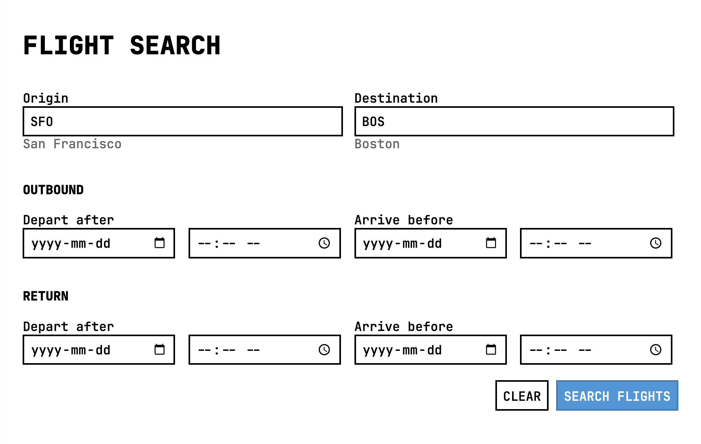
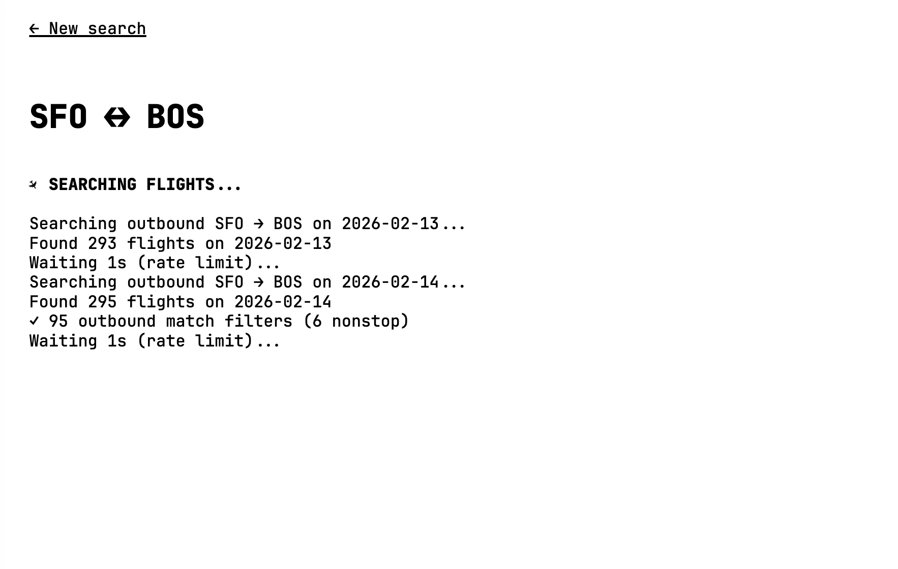
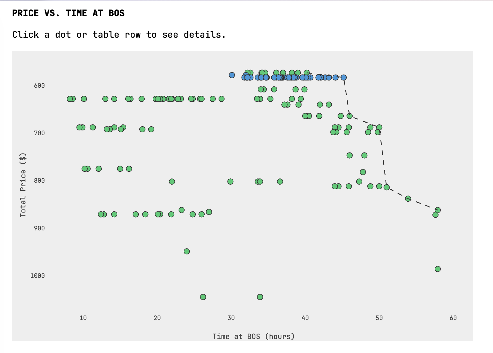
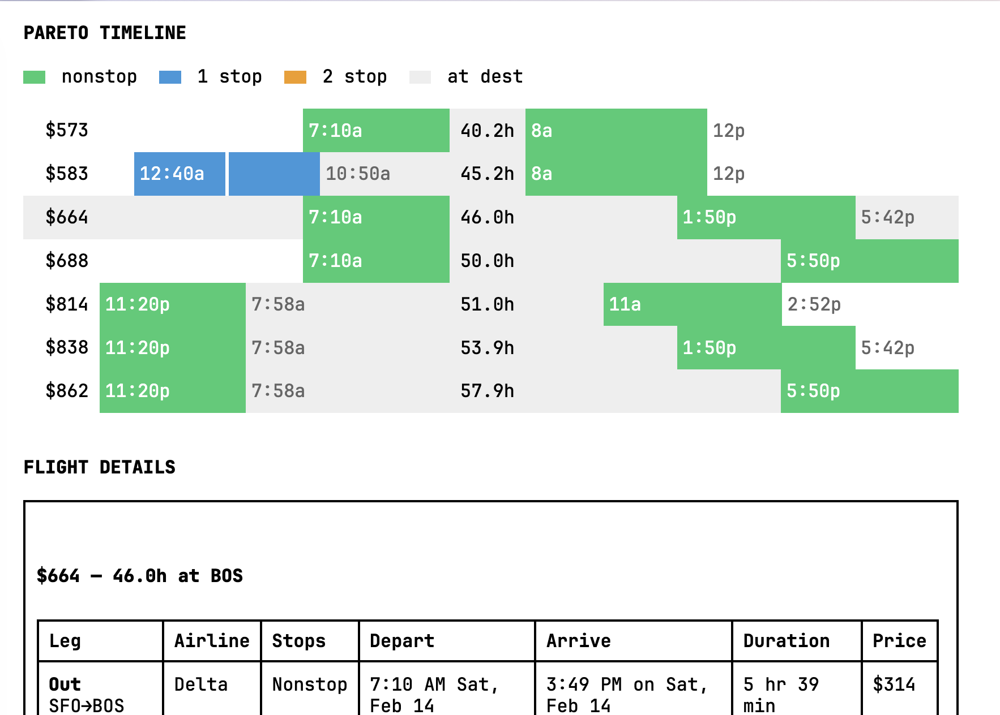

# weekend

Quick tool for finding "optimal" flights for a long weekend. Flights are pretty expensive right now but sometimes you get lucky and can find a cross-country ticket for *wayyy* less than it usually costs.

I wrote about this tool here: https://isaac.sh/daily/2026-02-09.

<table>
<tr>
<td></td>
<td></td>
</tr>
<tr>
<td></td>
<td></td>
</tr>
</table>

# running

This is a simple flask app that uses HTMX. It's designed for single-user deployments, e.g. run this locally on your machine. Think of this like a python script with a UI or something. (We need to have a better way to run these types of things.)

```
git clone https://github.com/slightknack/weekend && cd weekend
python3 -m venv venv && source venv/bin/activate
pip install flask fast-flights airportsdata
python app.py
```

Open `http://localhost:5001`

# provenance

Code:

| model | date | driver |
|---|---|---|
| claude-opus-4-5 | 2026-02-09 | Isaac Clayton |

`README.md`:

| date | author |
|---|---|
| 2026-02-09 | Isaac Clayton |

Vendored:

- `monospace.css` by Oskar Wickström
- `reset.css` by Eric A. Meyer

# license

CC0 1.0 Universal - Public Domain
